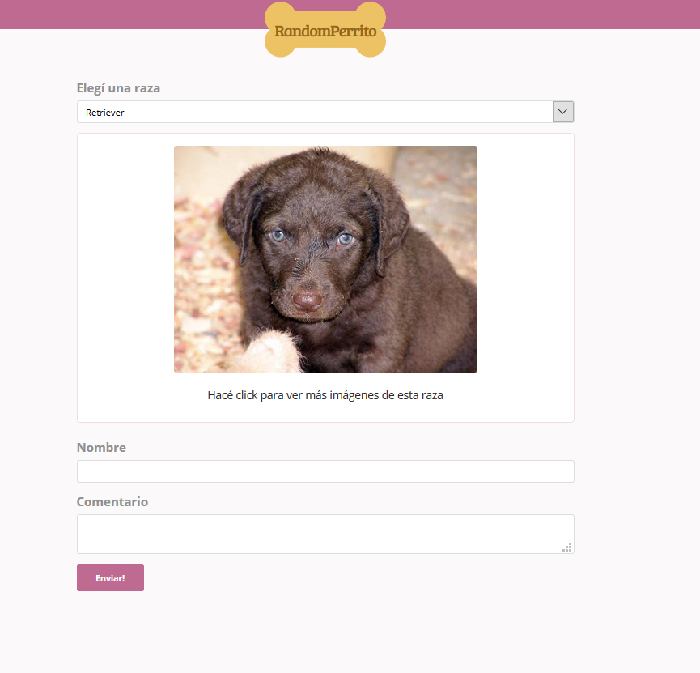

# RandomPerrito
Un buscador de imágenes de perros según raza, con la excusa de practicar llamadas async en React.

[Mejorá tu ánimo!](https://adperossa.github.io/randomperrito/)

## Descripción
Este proyecto surgió en el curso de React de TeamTreehouse como forma de aprender e investigar métodos async. Usa la API de [dog.ceo](http://dog.ceo), que muestra imágenes de perros de dominio público.

Está estructurado en un contenedor general, un componente para el Picker de razas y otro para renderizar la Imagen recibida.

Además, luego de la imagen, hay dos componentes más: Comentarios y Respuesta. No están relacionados con el resto, sino que sólo sirven de demo para mostrar también el envío de datos de un form a un endpoint externo. Se usa una API que hace eco de los datos (https://jsonplaceholder.typicode.com/), los cuales se muestran en Respuesta. Este componente sólo se muestra una vez recibido el eco. 

En una etapa posterior agregué algunas mejoras de usabilidad:
* Un feedback visual al hacer click para cargar una nueva imagen, así el usuario tiene una señal de que la app respondió a su interacción.
* Una animación de loading que se muestra mientras se carga la nueva imagen, con la misma intención.
* Un max-height de 500px para las imágenes, ya que no están normalizadas y algunas muy grandes distorsionaban el layout.

## TODO
Armar una API haciendo lo mismo pero con gatos ♥